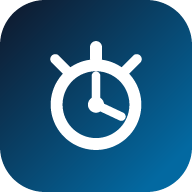

# ⏱ SignOut — Worker Attendance System

<p align="center">
  
</p>

<p align="center">
  <strong>NFC · QR · GPS · PWA · Offline-First</strong><br/>
  Tap to clock in. Track every hour. Run your workforce from any device.
</p>

<p align="center">
  
  
  
  
  
</p>

<p align="center">
  <a href="#-features">Features</a> •
  <a href="#-quick-start">Quick Start</a> •
  <a href="#-nfc-setup">NFC Setup</a> •
  <a href="#-admin-dashboard">Admin</a> •
  <a href="#-google-sheets-sync">Google Sheets</a> •
  <a href="#-android-build">Android</a>
</p>

---

## ✨ What is SignOut?

**SignOut** is a complete worker attendance & rota system that runs in the browser — no backend, no subscription. Install it as a PWA, hand out cheap NFC stickers, and workers tap to clock IN/OUT. Everything else — shifts, leave, GPS lock, analytics, Sheets sync — is built in.

Perfect for **restaurants, warehouses, retail, clinics, factories** — any team with 5–200 workers who need reliable time tracking.

---

## 🚀 Features

### 👷 For Workers
| Feature | Details |
|---|---|
| **NFC Tap Clock** | Tap an NTAG213 sticker → auto IN/OUT with timestamp |
| **PIN Login** | Search name → 4-digit PIN → device-locked session |
| **QR Badge Login** | Scan a printable QR badge via camera |
| **Break Tracking** | Start Break / Resume Work with net-hour calculation |
| **GPS Geofence** | Must be within workplace radius (configurable 20–500m) |
| **Selfie Verification** | Front-camera snap on clock-in (optional) |
| **Multi-Site Support** | Multiple workplaces with independent geofences |
| **My Schedule** | See personal rota, request leave, bid on open shifts |
| **History** | Week view grouped by day with daily totals |

### 🛡️ Security
- **Device fingerprint lock** — account bound to one phone after first login
- **Brute-force lockout** — 3 wrong PINs → 10 min lock
- **Shift time window** — only clock in during scheduled hours (±30 min)
- **Allowed days guard** — blocks clock-in on non-scheduled days
- **Auto-logout** — configurable inactivity timeout (1–60 min)
- **Leave guard** — workers on approved leave cannot clock in

### 📅 Rota & Scheduling
- Weekly grid (Mon–Sun) per worker
- 5 default shift types + unlimited custom shifts (with color)
- Save / load rota templates
- Copy week → next week
- Shift swap requests (pending / approved)
- Open shifts posted by admin → workers bid
- Rota vs Actual comparison table

### 📊 Admin Dashboard (PIN: `1234`)
| Tab | What it does |
|---|---|
| **📋 Logs** | Filter by worker/date, live stats, full log table with photos |
| **📅 Rota** | Full rota editor, shift types, week nav, CSV export |
| **📊 Summary** | Weekly hours per worker with OT / Late / Absent flags |
| **📈 Analytics** | Hours bar chart, punctuality split, heatmap |
| **🏖 Leave** | Approve / reject PTO / Sick / Personal requests |
| **🏢 Sites** | Add / remove geofenced workplaces |
| **📜 Audit** | Immutable admin action trail (last 500 events) |
| **👷 Workers** | Add / edit / delete, assign NFC, set shifts, reset device |
| **⚙ Settings** | Sheets, GPS, notifications, overtime rules, webhooks, backup |

### 🔔 Notifications & Integrations
- **Push notifications** — alerts when someone forgets to clock out (>10h)
- **WhatsApp daily report** — auto-sent at configured time via `wa.me` or webhook
- **Slack / Teams / Discord webhooks** — real-time overtime & late alerts
- **Web Audio feedback** — chimes on success/error (toggleable)
- **Google Sheets sync** — 1-click push of all logs + auto daily summary
- **CSV exports** — all logs / this week / this month / custom date range
- **JSON backup & restore** — full database export in one click

### 📱 Platform
- **PWA** — installs to home screen, works 100% offline, auto-syncs when back online
- **Kiosk Mode** — shared tablet at entrance with live clock, worker select + PIN pad
- **Capacitor Android** — `com.signout.attendance`, splash screen included
- **Service Worker** — `signout-v1` cache, offline-first fetch strategy

---

## 📸 Screenshots

> Replace these placeholders with your own screenshots after deploying.

| Login | Worker Today | Admin Logs | Rota |
|---|---|---|---|
|  |  |  |  |

---

## ⚡ Quick Start

### Option 1 — Just open it (zero install)

```bash
# No build step — it's vanilla HTML/CSS/JS
# Simply open index.html, or serve it:
npx serve .        # http://localhost:3000
# or
python -m http.server 8000
```

> **NFC requires HTTPS.** For local NFC testing use `npx serve --ssl` or deploy to GitHub Pages / Netlify.

### Option 2 — Deploy to GitHub Pages (free HTTPS)

1. Create a new GitHub repository (e.g. `signout`)
2. Push this project:
   ```bash
   git init
   git add .
   git commit -m "feat: initial SignOut release"
   git branch -M main
   git remote add origin https://github.com/<you>/signout.git
   git push -u origin main
   ```
3. In GitHub: **Settings → Pages → Source: `main` / root** → Save
4. Your live URL: `https://<you>.github.io/signout/`

### Option 3 — Netlify (drag & drop)

Drag the `signout` folder onto [app.netlify.com/drop](https://app.netlify.com/drop) — live HTTPS URL instantly.

### Option 4 — Android APK (Capacitor)

```bash
npm install
npx cap add android
npx cap sync
npx cap open android   # builds in Android Studio
```

---

## 📡 NFC Setup

1. Buy **NTAG213 stickers** (~$4 for 25 on AliExpress / Amazon)
2. Stick one per worker badge (or one per entrance door)
3. In SignOut: **Admin → Workers → Edit → Scan NFC Tag** → hold tag near phone → Save
4. Workers now tap to clock in/out instantly

> NFC requires **Android + Chrome** with NFC enabled in system settings. iPhone Web NFC is limited.

---

## 🔐 Admin Dashboard

- Open the app → tap **⚙ Admin** (or **Admin** button on login)
- Default PIN: **`1234`**
- Change it in **Settings → Change Admin PIN**, or via console:
  ```js
  DB.saveSettings({ adminPin: '9876' })
  ```

---

## 📊 Google Sheets Sync

Push every clock event to a Google Sheet with auto-formatting + daily summary:

1. Open [sheets.google.com](https://sheets.google.com) → New spreadsheet
2. **Extensions → Apps Script** → delete default code
3. Copy-paste the entire `google-apps-script.js` from this repo
4. **Deploy → New deployment → Web app** → Execute as: *Me*, Access: *Anyone* → Deploy
5. Copy the **Web App URL** → paste into **SignOut → Admin → Settings → Google Sheets Sync → Sync Now**

Three tabs are created automatically:
- **Attendance Logs** — every tap (color-coded IN/OUT)
- **Daily Summary** — total hours per worker per day
- **Workers** — roster snapshot

---

## 📍 GPS Location Lock

1. **Admin → Settings → GPS Location Lock → Enable**
2. Tap **📍 Use My Current Location** (while at the workplace), or paste lat/lng manually
3. Set radius (20–500m) with the slider → **Save GPS Settings**
4. Workers outside the radius will see `📍 Not at Workplace` and be blocked

Add extra sites in **Admin → Sites → + Add Site**.

---

## 🏖 Leave & Shifts

- **Workers:** `My Schedule → Request Leave` → pick PTO/Sick/Personal + dates + reason
- **Admin:** `Leave` tab → Approve / Reject
- **Rota:** assign shifts per worker/day, create custom shifts, manage swaps & open shifts

---

## 🗂️ Project Structure

```
signout/
├── index.html              # Single-page app (all views + modals)
├── manifest.json           # PWA manifest
├── service-worker.js       # Offline cache (signout-v1)
├── capacitor.config.json   # Capacitor Android config (com.signout.attendance)
├── google-apps-script.js   # Apps Script for Sheets sync
├── css/
│   └── styles.css          # All styling
├── js/
│   ├── db.js               # LocalStorage DB — workers, logs, rota, audit, locations, backup
│   ├── app.js              # Main controller — login, clock, kiosk, offline sync
│   ├── admin.js            # Admin dashboard — stats, summary, exports, settings
│   ├── workers.js          # Worker CRUD + device reset
│   ├── logs.js             # Log table + weekly summary helpers
│   ├── rota.js             # Rota grid, shift templates, swaps, open shifts
│   ├── gps.js              # Haversine geofence check
│   ├── nfc.js              # Web NFC handler
│   ├── qr.js               # QR badge scanner (BarcodeDetector)
│   ├── selfie.js           # Front-camera capture
│   ├── notify.js           # Push + WhatsApp reports
│   ├── webhooks.js         # Slack/Teams/Discord dispatcher
│   ├── audio.js            # Web Audio chimes
│   ├── face.js             # Lightweight face-presence check
│   ├── device.js           # Fingerprint + short ID
│   └── pdf.js              # PDF export helper
└── icons/
    ├── icon-192.png
    └── icon-512.png
```

---

## 💾 Data & Backup

All data lives in `localStorage` (no server). Keys:

```
signout_workers, signout_logs, signout_settings, signout_lockouts,
signout_rotas, signout_shifts, signout_swaps, signout_audit,
signout_locations, signout_leave_reqs, signout_open_shifts
```

- **Admin → Settings → Database → Export Backup (JSON)** — downloads everything
- **Restore Backup** — pick a JSON file to restore (audit-logged)
- Clear all data: `localStorage.clear(); location.reload();` in console

---

## 🔧 Configuration

| Setting | Where | Default |
|---|---|---|
| Admin PIN | Settings | `1234` |
| GPS radius | Settings | `100m` |
| Inactivity logout | Settings | `5 min` |
| Daily overtime | Settings | `8h` |
| Weekly overtime | Settings | `40h` |
| WhatsApp report time | Settings | `18:00` |
| Audio feedback | Settings | `ON` |
| Webhook URL | Settings | _(empty)_ |

---

## 🧪 Troubleshooting

| Problem | Fix |
|---|---|
| NFC doesn't scan | Chrome + Android only; enable NFC in system settings; serve over HTTPS |
| Unknown tag | Admin → Workers → Edit → Scan NFC Tag to assign |
| App won't install | Must be served over HTTPS |
| Sheets sync fails | Check Web App is deployed as **Anyone**, URL is correct |
| Forgot admin PIN | Console: `DB.saveSettings({ adminPin: '1234' })` |
| Wrong device error | Admin → Workers → Reset Device for that worker |
| GPS blocked incorrectly | Increase radius or re-capture location outdoors |
| Photos not saving | Selfie requires camera permission over HTTPS |

---

## 🤝 Contributing

PRs welcome! Keep it vanilla — no framework, no bundler required.

```bash
git checkout -b feat/my-feature
# make changes
git commit -m "feat: my feature"
git push -u origin feat/my-feature
```

---

## 📄 License

MIT — free for personal and commercial use. See [LICENSE](LICENSE) if present.

---

<p align="center">
  Built with ❤️ — Web NFC + PWA + LocalStorage — <strong>SignOut v1.0</strong>
</p>
